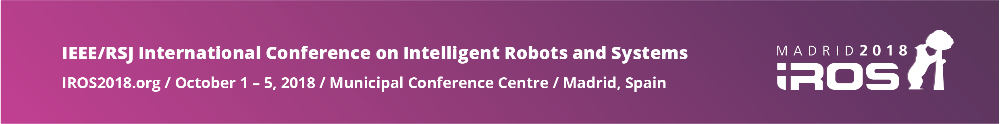

<!-- pic here -->

# [IROS 2018](https://www.iros2018.org) Tutorial on Collaborative Robotics Toolkit (CRTK) and Open Platforms for Medical Robotics Research

**Tutorial Date:**  October 5, 2018

**Venue:** Madrid Municipal Conference Centre, Madrid, Spain

**Room:** 2.R2 (Bogota)

## Objectives
The objectives are to provide an in-depth tutorial on recent advances in open platforms for medical robotics research. This originated with two widely used open platforms, the Raven II robot and da Vinci Research Kit (dVRK), which are installed at more than 40 institutions worldwide, but has broadened to include other robots and devices, including simulated robots. The tutorial will first present the [Collaborative Robotics Toolkit (CRTK)](https://github.com/collaborative-robotics), which defines a common API to the Raven, dVRK and other systems.  It will cover the concepts and design of CRTK, followed by its ROS implementation.  The integration of CRTK with popular simulation/visualization platforms, including rviz, Gazebo, and Matlab, will be covered in depth and attendees will have an opportunity for hands on experimentation, using haptic input devices to teleoperate simulated robots and remote Raven II and dVRK robots.

The tutorial will also include a _Contribution Guide_ session, which will explain best practices of software configuration management, including git workflows, and information about how to contribute to the evolving software infrastructure.
This will be followed by a presentation of one community contribution to the dVRK.
In addition, the tutorial will cover the architecture and low-level programming environment of the Raven II and dVRK robots.  This would be of interest to researchers who wish to modify the low-level control of these platforms, rather than relying on higher-level interfaces via CRTK and ROS.

## Organizers

|Peter Kazanzides          | Blake Hannaford           | Gregory S. Fischer              |
|Johns Hopkins University  | University of Washington  | Worcester Polytechnic Institute |

## Preliminary Program

| Time  | Topic        | Speakers | Details |
|:------|:-------------|:---------|:--------|
| 09:00 | Introduction | Peter Kazanzides (JHU) | Welcome and schedule for the tutorial |
| 09:10 | Historical Context | Jie Ying Wu (JHU), Melody Su (UW) | Overview of Raven II and dVRK |
| 09:40 | Use Cases    | Peter Kazanzides (JHU) | Use cases to be addressed |
| 10:00 | Discussion   | | Brief discussion and Q&A |
| 10:15 | CRTK         | Anton Deguet (JHU) | Collaborative Robotics Toolkit (Common API), design and overview |
| 11:00 | Coffee Break | | |
| 11:30 | ROS          | Anton Deguet (JHU) | ROS implementation of CRTK, including Python client |
| 12:15 | Simulators   | Adnan Munawar (WPI) | Input devices and simulated robots |
| 13:00 | Contribution Guide | Anton Deguet (JHU) | Git workflow, mechanisms for contributions |
| 13:30 | Lunch | | |
| 14:30 | Community Contribution | Samuel Au (CUHK) | Gravity compensation and virtual fixtures |
| 15:00 | Hands On | | Hands on sessions with input devices and simulated/remote robots; open discussion |
| 16:30 | Coffee Break | | |
| 17:00 | dVRK/Raven II | Peter Kazanzides (JHU), Melody Su (UW) | dVRK and Raven II internals |
| 18:30 | Wrapup | Peter Kazanzides (JHU) | Final questions, feedback on content and format, plans for future |
| 19:00 | Adjourn | | |
