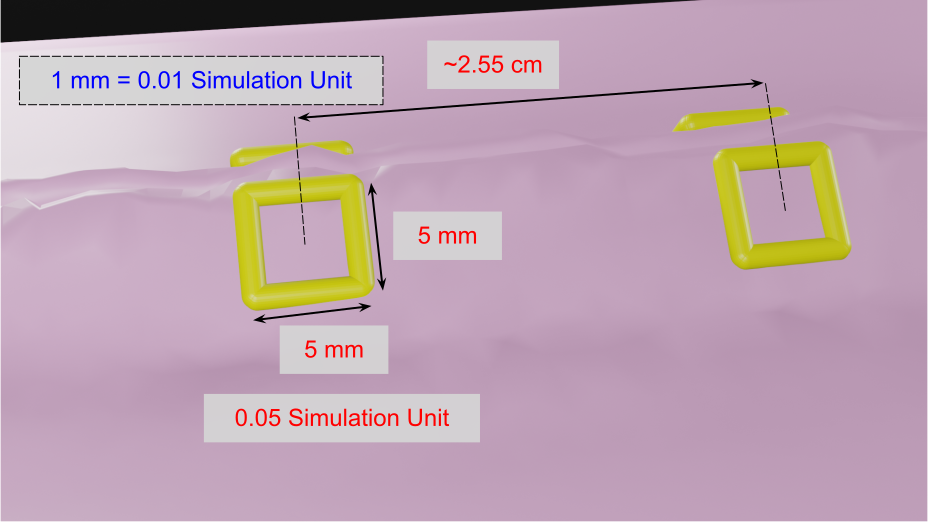

## Challenge 2: Grasp needle and drive through tissue

### Task

Move large needle driver to grasp the needle and then move the needle tip to the target
and drive the needle through the tissue until the tip exits.
The accuracy of the simulated robot
will be comparable to that of a real robot and thus visual feedback would be required to ensure
accurate performance.

The needle should be grasped near its base (i.e., back third of needle) with the gripper orthogonal to
the plane of the needle. However, the evaluation metrics
do not consider the needle grasp pose, so any pose that produces successful results
is acceptable.

<video width="960" height="540" autoplay muted loop>
  <source type="video/mp4" src="/surgical-robotics-challenge/task2_clip.mp4">
Your browser does not support the video tag.
</video>

### Provided Data

1. Ground-truth pose of needle
2. Ground-truth poses of first target entry and exit on phantom

Note that the entry and exit points are specified as poses (transforms). See this
[figure](https://github.com/collaborative-robotics/surgical_robotics_challenge/blob/master/docs/scene_coordinate_frames.md#entry--exit-frames).
These coordinate frames will always be defined so that the XZ planes
are aligned. The expectation is that the needle trajectory will primarily be a rotation about
the Y axis (i.e., in the XZ plane), though the evaluation metric does not require this.

### Test Conditions

Each entry will be tested with multiple trials, where the needle position and
target positions will vary for each trial. In addition, the kinematic parameters of the robot will
vary from the nominal values to emulate robot inaccuracy. Specifically, the simulator will use the
nominal kinematic parameters for inverse kinematics (e.g., to convert Cartesian goals into joint
goals), but then will use the perturbed kinematic parameters in the forward kinematics to compute
the Cartesian trajectory of the simulated robot. For some trials, the kinematic parameters will
have little or no error, thereby allowing the task to be completed without visual feedback,
whereas for other trials, visual feedback will be necessary to successfully complete the task.
Stereo endoscope video will be provided at 1080p resolution at 30 fps.

### Evaluation Metric

Entries will be judged based on the time the algorithm required to perform
the task and the achieved accuracy. Accuracy will be measured by the distance between the needle
trajectory and the target entry and exit positions, and the amount of needle that is visible
beyond the exit point. All entries must be within +/-2.5 mm of the target entry/exit and at
least 5 mm of the needle tip must be visible. Note that the squares surrounding the entry/exit points have dimensions
5 mm x 5 mm (0.05 x 0.05 simulation units, see figure below), so the needle must pass within these squares.
All entries that pass the accuracy threshold will be ranked based on completion time.

