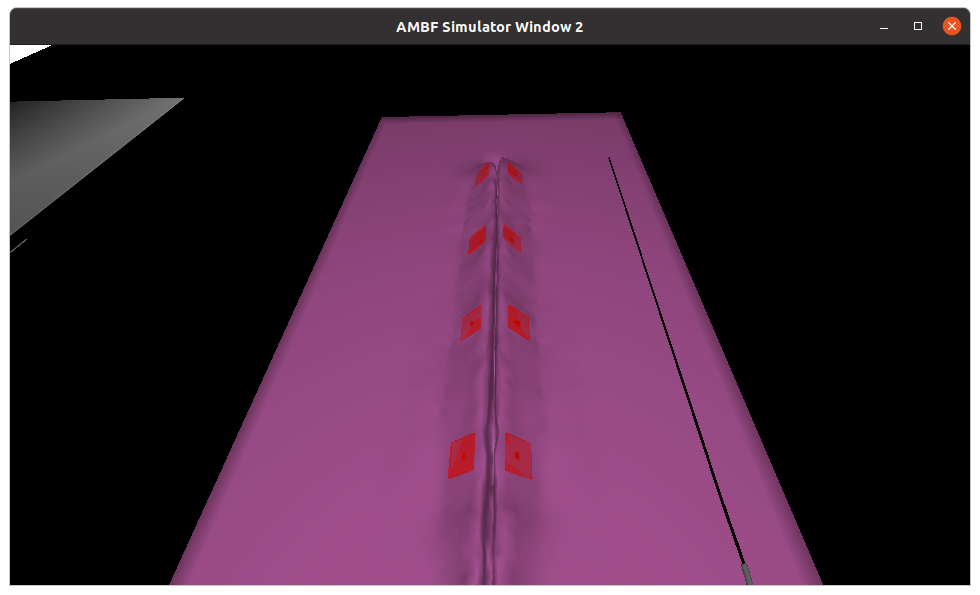

## Results

TBD

### Evaluation Conditions

#### Challenge 1

The following three scenes were used in the evaluation:

#### Challenges 2 and 3

The following scene was used in the evaluation, with different robot kinematic errors:

Robot kinematic errors:

|             | Joint errors |
|-------------|--------------|
| Condition A | [ 0.0, 0.0, 0.0 ] |
| Condition B | [ 0.044, -0.008, 0.04 ] |
| Condition C | [0.036, -0.04, -0.03 ] |
