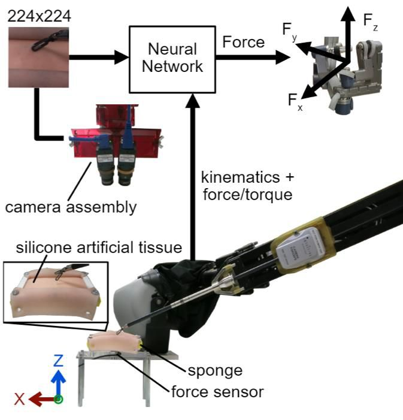

 <h2> Characterization of Haptic Feedback from Multimodal Neural Network-based Force Estimates during Teleoperation </h2> 

Force estimation using vision- and robot state-based neural networks is a promising approach to enable haptic feedback in teleoperated minimally invasive surgical robots without the need for end-effector force sensors. Prior systems using neural networks for force estimation have not been systematically tested during real-time teleoperation with surgery-like manipulations of soft tissue. Thus, the real-time transparency and human-in-the-loop stability of multimodal neural network-based force estimation remains uncharacterized. Building on our prior work using neural network architectures that use vision-only, state-only, or combined state and vision inputs to estimate force, we quantified the transparency of real-time force feedback estimated from neural networks and rendered on a da Vinci Research kit and compared them to a physics-based dynamic model and direct force sensing. To measure real-time open-loop transparency, we performed autonomous vertical displacements of a da Vinci instrument while in contact with silicone artificial tissue and derived the effective tissue stiffness rendered for each force estimation method. To measure human-in-the-loop stability and transparency during real-time haptic feedback with good repeatability, we simulated 1-degree-of-freedom human dynamics during teleoperation with haptic feedback from each method in each of the Cartesian directions. Our results suggest that methods that include robot state inputs show better transparency, but with a tendency to oscillate when the feedback loop is closed.
